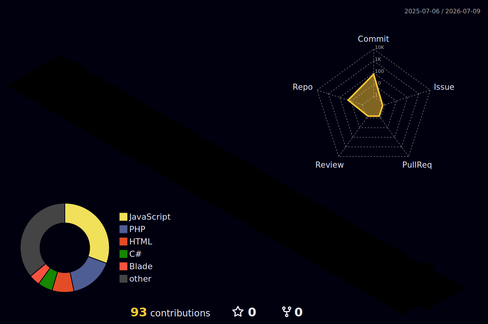

  

<h1 align="center">Hi, I'm Salman Arefin 👋</h1>

<h3 align="center">
  Software Engineer | Full-Stack Web Developer
</h3>

  
  
  

  

---

## 👨‍💻 Who I Am

I am **Salman Arefin**, a Bangladeshi **Software Engineer** and **Full-Stack Web Developer**.

I completed my **BSc in Computer Science and Engineering** from **American International University-Bangladesh (AIUB)**, majoring in **Software Engineering**. I focus on building clean, scalable, database-driven, and user-focused software solutions.

I work with **React.js, Next.js, NestJS, ASP.NET, Laravel, PHP, MySQL, PostgreSQL, and Oracle** to develop practical software systems and real-world web applications.

---

## 🚀 What I Do

- Build full-stack web applications from frontend to backend
- Develop backend APIs, authentication systems, admin panels, and CRUD features
- Design responsive and user-friendly frontend interfaces
- Work with relational databases and database-driven applications
- Test APIs and debug workflows using professional development tools
- Prepare software requirement analysis, system design, and documentation

---

## 🛠️ Technical Skills

### Programming Languages

  
  
  
  
  
  

### Frontend Development

  
  
  
  

### Backend Development

  
  
  
  

### Databases

  
  
  

### Tools & Platforms

  
  
  
  
  
  

---

## 📌 Featured Projects

## 📌 Featured Projects

<table>
  <tr>
    <td width="50%">
      <h3>🏢 Advanced ERP HRMS Management System</h3>
      

        A professional role-based ERP and Human Resource Management System for managing employees, departments, designations, attendance, leave applications, payroll, reports, audit logs, user roles, and dashboard analytics.
      

      

        <b>Key Features:</b> Role-based access control, employee management, attendance tracking, leave approval workflow, payroll processing, report filtering, printable reports, audit logs, dashboard pie chart, attendance trend line chart, validation, and professional UI.
      

      
<b>Architecture:</b> Folder-based 3-tier architecture with MVC Controllers, Services, ViewModels, Entity Framework Core, and SQL Server.

      
<b>Tech Stack:</b> ASP.NET Core MVC, C#, Entity Framework Core, SQL Server, ASP.NET Core Identity, Bootstrap, Chart.js

      <a href="https://github.com/salmanarefin/Advanced_ERP_Management_System">View Repository</a>
    </td>
    <td width="50%">
      <h3>🏥 E-Pharmacy Shop Management System</h3>
      
A full-stack web application for managing pharmacy inventory, medicines, sales, customers, orders, and pharmacy operations.

      
<b>Tech Stack:</b> NestJS, Next.js, React.js, PostgreSQL

      <a href="https://github.com/salmanarefin/E-Pharmecy_management_system">View Repository</a>
    </td>
  </tr>

  <tr>
    <td width="50%">
      <h3>🏨 Hostel Management System</h3>
      
A web-based hostel management system for managing seats, customers, bookings, rent payments, leave/exit requests, offers, authentication, and admin approval workflows.

      
<b>Tech Stack:</b> Laravel, PHP, MySQL, Blade, Tailwind CSS, JavaScript

      <a href="https://github.com/salmanarefin/hostel_management_system">View Repository</a>
    </td>
    <td width="50%">
      <h3>📚 Library Management System</h3>
      
A web-based system for managing books, users, borrowing records, returns, and library administrative workflows.

      
<b>Tech Stack:</b> ASP.NET, C#, SQL

      <a href="https://github.com/salmanarefin/Library_management_system-Asp.net-">View Repository</a>
    </td>
  </tr>

  <tr>
    <td width="50%">
      <h3>🛒 Supershop Management System</h3>
      
A dynamic web-based application for managing products, sales, customer data, and daily shop operations.

      
<b>Tech Stack:</b> HTML, CSS, JavaScript, PHP, MySQL

      <a href="https://github.com/salmanarefin/Supershop_management">View Repository</a>
    </td>
    <td width="50%">
      <h3>🌾 Agricultural Shop Management System</h3>
      
A management system for handling agricultural products, inventory, sales, customer records, stock tracking, and transactions.

      
<b>Tech Stack:</b> C#, Database

      <a href="https://github.com/salmanarefin/AGRICULTURE-MANAGEMENT-C-SHARP">View Repository</a>
    </td>
  </tr>

  <tr>
    <td width="50%">
      <h3>🤟 Real-Time Sign Language Translation</h3>
      
A real-time sign language translation project that converts gestures into text using computer vision concepts with requirement analysis, system design, UI/UX planning, risk analysis, and testing.

      
<b>Tech Stack:</b> SRE, SQT, Computer Vision

      <a href="https://github.com/salmanarefin/RealTimeLanguageTranslationForSignLanguage">View Repository</a>
    </td>
    <td width="50%">
      <h3>✈️ Airplane Ticket Management System</h3>
      
A Java-based management system for handling flight ticket booking, passenger records, ticket information, and basic airline management operations.

      
<b>Tech Stack:</b> Java, OOP, Database Concepts

    </td>
  </tr>
</table>
---

## 📊 GitHub Analytics

  
  

  

---

## 🧊 3D Contribution Graph

  

---

## 🎓 Education

**BSc in Computer Science and Engineering**  
American International University-Bangladesh  
Major: Software Engineering  
CGPA: 3.45 / 4.00

---

## 📜 Certifications

- Cisco IT Essentials — PC Hardware and Software
- Excel Essentials — UNICEF GenU P2E
- Workplace Communication — UNICEF GenU P2E
- bKash Limited Technical Vetting Certificate — Team Pro5.ai
- ASP.NET Technical Vetting Certificate — Pro5.ai

---

## 📫 Connect With Me

  
  

  <b>Let’s build reliable software that creates real value.</b>

